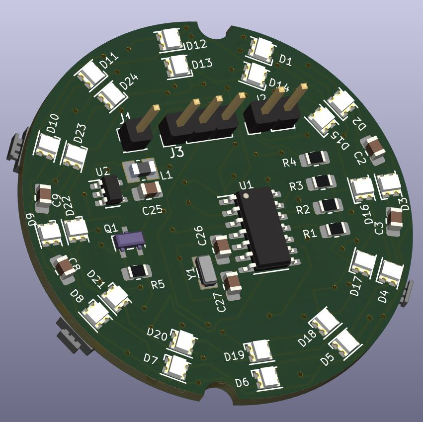
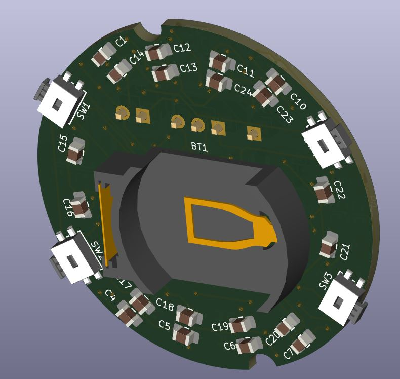

# watch_with_leds
A low-power digital watch built with C/C++ on an ATtiny microprocessor. The time is read via colour-shifting LEDs, with each light representing a 5-minute interval. The custom firmware features dynamic light effects that automatically activate during hour and minute transitions.

# PCB design

